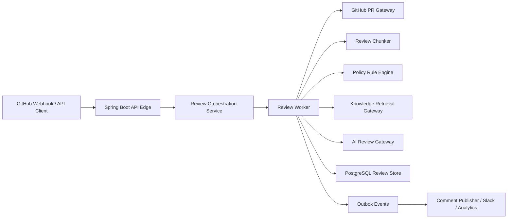

# PR Intelligence Platform

PR Intelligence Platform is a Java-first backend for AI-assisted pull request review. It is intentionally built like a production analysis service: PR ingestion, asynchronous orchestration, policy-pack-aware finding generation, chunked review lanes, retrieval-enriched architecture guidance, and outbox events for downstream publishing.

## Fully Java implementation

This project is built fully in Java using Spring Boot.

- No Python service is used in the backend
- No Python runtime is required to run the application
- The review pipeline, policy engine, orchestration, and AI integration boundaries are all implemented in Java

The current AI layer is implemented as a deterministic Java gateway so the system is easy to run and explain locally. The architecture is intentionally prepared for future Java-based LLM integrations through Spring AI or LangChain4j without changing the core service design.

## Recruiter-friendly framing

Built a Java Spring Boot PR intelligence platform that performs AI-assisted code review, security analysis, architectural rule checks, and retrieval-based engineering recommendations.

## Core capabilities

- Accept pull request review jobs through REST APIs
- Deduplicate retries with idempotency keys
- Route large PRs into chunked review lanes to keep analysis bounded
- Ingest PR snapshots through a GitHub gateway boundary
- Run policy-pack-aware heuristics for security, architecture drift, and code smells
- Retrieve engineering standards context through a vector-search boundary
- Generate executive summaries and architecture guidance through an AI gateway
- Persist findings, review history, and outbox events

## Architecture



## Key design choices

- `ReviewJob` tracks lifecycle, risk score, and review summary.
- `PolicyPack` lets the same engine enforce different review standards for fintech, platform, or zero-trust repos.
- `ReviewChunker` groups changed files into review lanes such as trust-boundary, request-edge, and runtime-policy.
- `ReviewFinding` stores structured findings with severity, category, file path, and recommendation.
- `ReviewOrchestrationService` owns idempotent submission and async dispatch.
- `ReviewWorker` splits ingestion from chunking, policy analysis, retrieval, and finding persistence in one transactional workflow.
- `GitHubPullRequestGateway`, `KnowledgeRetrievalGateway`, and `AiReviewGateway` are explicit seams for real integrations.
- The current implementation uses deterministic and in-memory adapters so you can demo locally without external services.

## API quickstart

### Submit a PR review

```bash
curl -X POST http://localhost:8081/api/reviews \
  -H "Content-Type: application/json" \
  -d '{
    "repositoryName":"acme/payments",
    "pullRequestNumber":41,
    "author":"jeshwin",
    "baseBranch":"main",
    "headBranch":"feature/auth-hardening",
    "policyPack":"FINTECH"
  }'
```

### Fetch review result

```bash
curl http://localhost:8081/api/reviews/<review-job-id>
```

## Local development

```bash
mvn spring-boot:run
```

## Docker

```bash
mvn clean package
docker compose up --build
```

## Strong next steps

1. Replace the stub GitHub gateway with GitHub App or PAT-based API ingestion.
2. Add Spring AI or LangChain4j provider implementations for OpenAI, Gemini, or Azure OpenAI.
3. Use `pgvector` to retrieve team-specific coding standards and previous review patterns.
4. Drain outbox events into a comment publisher that writes back to GitHub.
5. Expand policy packs into OWASP, architecture boundaries, service ownership rules, and repo-specific reviewer personas.
